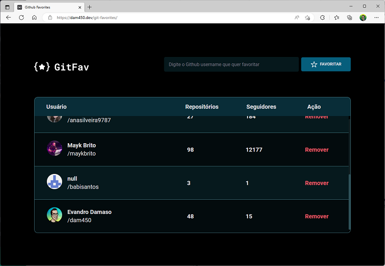

<h1 align="center">Github Favorites</h1>

  <a href="#-deploy">Deploy</a>&nbsp;&nbsp;&nbsp;|&nbsp;&nbsp;&nbsp;
  <a href="#-tecnologias">Tecnologias</a>&nbsp;&nbsp;&nbsp;|&nbsp;&nbsp;&nbsp;
  <a href="#-projeto">Projeto</a>&nbsp;&nbsp;&nbsp;|&nbsp;&nbsp;&nbsp;
  <a href="#-layout">Layout</a>&nbsp;&nbsp;&nbsp;|&nbsp;&nbsp;&nbsp;

  

## 🚀 Deploy

O projeto está hospedado no Github Pages e pode ser acessado através do link [dam450.github.io/git-favorites](https://dam450.github.io/git-favorites/).

 
  

## 🦾 Tecnologias

Esse projeto foi desenvolvido com as seguintes linguagens e recursos:

  

- HTML 
    - [dataset](https://developer.mozilla.org/en-US/docs/Web/API/HTMLElement/dataset)
- CSS
    - Animações CSS
- Javascript
    - Funções, Callback e eventListeners
    - Manipulação da DOM
    - [LocalStorage](https://developer.mozilla.org/en-US/docs/Web/API/Window/localStorage)
- API
  - [GitHub REST API](https://docs.github.com/en/rest/guides/getting-started-with-the-rest-api)

## 💻 Projeto

Neste projeto o desafio foi criar um app para salvar os perfis github favoritos do usuário. Os dados ficam salvos localmente fazendo uso do recurso ***LocalStorage***.

Como melhoria, adicionei um filtro que ao digitar o nome do usuário mostra na lista os nomes que já estão na lista e que contém o texto informado.

## 🔖 Layout

Para visualizar o layout **Figma** criado para esse projeto clique [AQUI](https://www.figma.com/file/IV3hH8wgkFELXc8ORipIP8/GitFav-%5BDesafios-Explorer%5D?node-id=104%3A48&viewer=1).

## :memo: Licença

Esse projeto está sob a licença [MIT](./license.md).

---

Feito com ♥ by [Dam450](https://github.com/dam450/)
